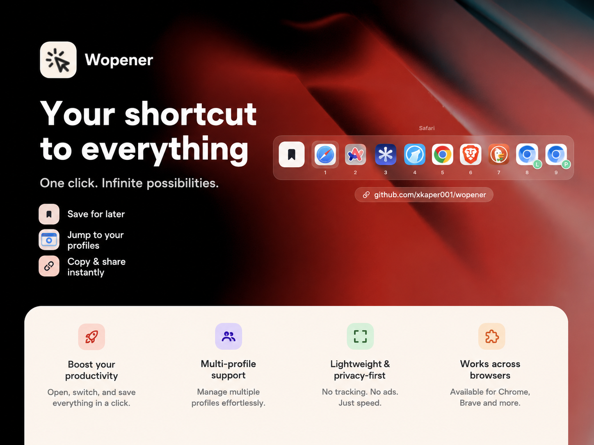
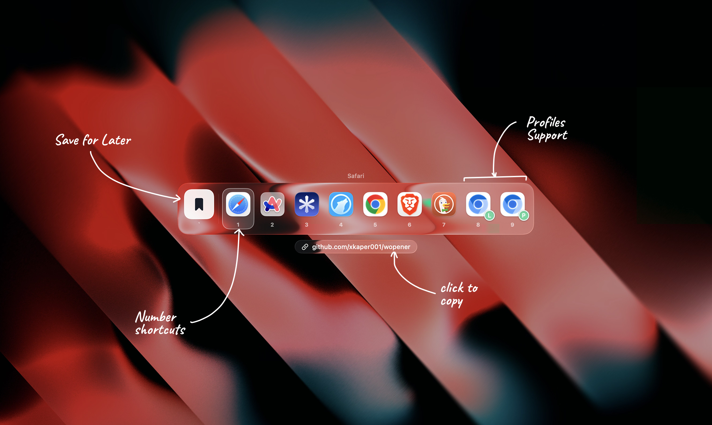

<div align="center">

# Wopener

**The Web Opener Apple Forgot.** 



A macOS default-browser interceptor with a Liquid Glass picker. Set Wopener as your
system default browser, and every link click pops a centered glass picker so *you*
decide which real browser opens it — no rules to babysit, no routing memory to
second-guess.

[](LICENSE)
[](#requirements)
[](https://swift.org)

</div>

---

## Why

macOS only lets you pick *one* default browser. If you use Chrome for work, Safari for
personal, and a private browser for the rest, every link is a wrong guess. Wopener
becomes the default, intercepts the click, and shows a picker instead of committing for
you.

<div align="center">



</div>

## Features

- **Glass picker on every link** — a borderless full-screen overlay with a card of
  browser tiles, built on Apple's Liquid Glass (`.glassEffect`).
- **Keyboard-first** — `1`–`9` open that browser instantly, `←`/`→` move the selection,
  `↩` opens the highlighted one, `Esc` cancels.
- **Per-profile entries** — Chromium-family browsers (Chrome, Brave, Edge, Vivaldi,
  Opera…) expand into one tile per profile, with the signed-in account photo as a badge.
- **Save for later** — press the save key (default `` ` ``) in the picker to stash a
  link in the **Saved** tab instead of opening it. Reopen the picker for it anytime.
- **Reorderable & toggleable browsers** — drag to set the number-key order; switch any
  browser off to hide it from the picker.
- **Configurable picker** — choose where it anchors on screen (9 positions), where the
  URL chip sits, whether number hints show, and which key saves.
- **Copy the link** — tap the detached URL chip to copy without opening anything.
- **Lives in the menu bar** — Wopener runs as a background agent with no Dock icon. The
  menu-bar icon opens the window, sets the default browser, or quits. The main window
  only appears when you ask for it.
- **Opens at login** — enabled by default via `SMAppService`, so Wopener is ready to
  catch the first link after a restart. Toggle it off in the General tab or System
  Settings ▸ Login Items.
- **No routing memory by design** — Wopener never silently picks for you. The only
  persisted state is your browser order, toggles, saved links, and preferences.

## Requirements

- macOS 26.0 or later
- Xcode 26+ (to build from source)

## Install

### Build from source

```sh
git clone https://github.com/xkaper001/wopener.git
cd wopener
xcodebuild -project Wopener.xcodeproj -scheme Wopener -configuration Debug build
```

Or open `Wopener.xcodeproj` in Xcode and run (⌘R).

### Set as default browser

1. Launch Wopener.
2. Go to the **Browsers** tab → **Set as Default Browser** (this surfaces the standard
   macOS confirmation dialog), *or* set it manually in **System Settings ▸ Desktop &
   Dock ▸ Default web browser → Wopener**.
3. Click any link — the picker appears.

### "Wopener is damaged / can't be opened" — the Gatekeeper jail

If you grabbed a pre-built `.dmg` (not built it yourself), macOS will refuse it on first
launch: *"Wopener can't be opened because Apple cannot check it for malicious software."*

That's **not a bug and not malware** — it's Gatekeeper doing its job on an app that
hasn't been notarised yet (see below for *why*). Spring it out once and macOS remembers:

- **Right-click** (or Control-click) the app → **Open** → **Open** again in the dialog, *or*
- Open it once, then **System Settings ▸ Privacy & Security ▸ Open Anyway**, *or*
- From a terminal: `xattr -dr com.apple.quarantine /Applications/Wopener.app`

You only do this once. Building from source skips it entirely — you sign locally.

## 🔓 Help bust Wopener out — the $99 Apple Tax

> ✅ **Update:** **[Kimchi](https://tr.ee/lpzVfB)** sponsored the Apple Developer
> Program — the first year of the Apple Tax is **covered**. Notarised, double-click-to-open
> releases are on the way. The Gatekeeper steps above still apply until those ship.

Here's the honest part: **Wopener is currently unsigned and un-notarised** because
notarising a Mac app requires the Apple Developer Program — **$99/year**, every year,
forever. This is a free, open-source, Apache-2.0 weekend tool, and thanks to **Kimchi**
that wall is paid down for year one. Ongoing sponsorship keeps it paid so no scary dialog
ever comes back.

**The quest:** keep the Apple Tax funded so every release ships notarised — no scary
dialog, no `xattr` incantations, just double-click-and-go for everyone who comes after.

| Tier | Unlocks |
|------|---------|
| ☕ **$1–9** | You bought a brick of the wall we're tearing down. Eternal gratitude + a warm fuzzy. |
| 🔑 **$10+** | Your name in `SPONSORS.md` and the About pane — co-signers of freedom. |
| 🪄 **$99 total** | **One full year of notarised releases.** Gatekeeper jail: demolished. |
| 🛡️ **$99/yr recurring** | Notarisation on autopilot, forever. The wall never comes back. |

> **[→ Sponsor and help notarise Wopener](https://github.com/sponsors/xkaper001)**

Can't spare cash? Free ways to help that move the needle just as much:

- ⭐ **Star the repo** — visibility is fuel.
- 🐦 **Tell one person** who's tired of "open in the wrong browser." Word of mouth funds word of mouth.
- 🏢 **Work somewhere with an Apple Developer account?** Notarising a third-party
  open-source build costs *nothing* extra on an existing account — [open an issue](https://github.com/xkaper001/wopener/issues)
  and let's talk about co-signing releases.

Every dollar and every star gets Wopener closer to "just works." 🪄

## Usage

| Action | How |
|--------|-----|
| Open a link in a browser | Click its tile, or press its number key (`1`–`9`) |
| Move selection | `←` / `→` |
| Open highlighted browser | `↩` |
| Cancel | `Esc`, or click the dimmed backdrop |
| Copy the link | Click the URL chip |
| Save for later | Press the save key (default `` ` ``), or click the Save tile |

Manage everything from the main window's four tabs: **Saved**, **Browsers**,
**General**, **About**.

## Architecture

Swift 5, SwiftUI, `MainActor` default isolation. Unsandboxed background agent
(`LSUIElement`), Developer ID / direct distribution. All source lives in `Wopener/`; the
picker UI is **glass-first** (`GlassEffectContainer` + `.glassEffect`).

See **[`docs/architecture.md`](docs/architecture.md)** for the per-file breakdown, build
instructions, and gotchas.

## Sponsors

Wopener is sponsored by **Kimchi**, who funded the Apple Developer Program so notarised,
double-click-to-open releases can ship. Huge thanks. 💙

<p align="center">
  <a href="https://tr.ee/lpzVfB" aria-label="Kimchi">
    
  </a>
</p>

Want your name here? [Become a sponsor →](https://github.com/sponsors/xkaper001)

## Contributing

Issues and pull requests are welcome — come tinker. ✨ By contributing you agree your
contributions are licensed under the project's Apache 2.0 license. Build + verification
notes live in [`docs/architecture.md`](docs/architecture.md).

## License

Licensed under the [Apache License 2.0](LICENSE). See [`NOTICE`](NOTICE) for attribution.

```
Copyright 2026 xkaper001
```

Made by [@xkaper](https://github.com/xkaper001).
