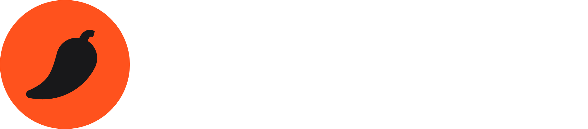

# Sponsors

Wopener is free, open source (Apache 2.0), and built in spare time. Sponsors pay down the
**Apple Tax** — the $99/yr Apple Developer Program that lets releases ship notarised, so
they open with a double-click instead of a Gatekeeper warning.

## Funding the Apple Developer Program

  

**[Kimchi](https://tr.ee/lpzVfB)** sponsored Wopener's enrollment in the Apple Developer
Program, covering the first year of the Apple Tax so notarised releases can ship. Thank
you. 💙

## Become a sponsor

Want to keep Wopener notarised — or just say thanks? **[Sponsor on
GitHub →](https://github.com/sponsors/xkaper001)**

- 🔑 **$10+** — your name here and in the app's About pane.
- 🛡️ **$99/yr** — keep notarisation on autopilot, forever.

Can't spare cash? Star the repo and tell one person. Visibility is fuel.
